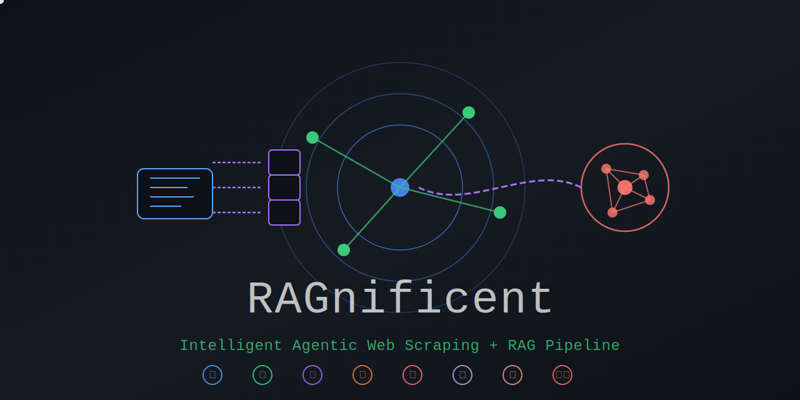

# RAGnificent 🔄📝

RAGnificent combines Python and Rust components to scrape websites and convert HTML content to markdown, JSON, or XML formats. It supports sitemap parsing, semantic chunking for RAG (Retrieval-Augmented Generation), and includes performance optimizations through Rust integration.

Key features include HTML-to-markdown/JSON/XML conversion with support for various elements, intelligent content chunking that preserves document structure, and systematic content discovery through sitemap parsing. The hybrid architecture uses Python for high-level operations and Rust for performance-critical tasks.

Check out the [deepwiki](https://deepwiki.com/krljakob/RAGnificent/) for a granular breakdown of the repository contents, purpose and structure.

## Documentation

- 📖 **[Features](docs/FEATURES.md)** - Comprehensive feature overview and capabilities
- ⚙️ **[Configuration](docs/CONFIGURATION.md)** - Configuration management and environment setup
- 🚀 **[Optimization](docs/OPTIMIZATION.md)** - Performance tuning and optimization guide

## Installation

```bash
git clone https://github.com/krljakob/RAGnificent.git
cd RAGnificent

# Quick setup
./build_all.sh  # Unix/macOS
# or: .\build_all.ps1  # Windows

# Manual setup
uv venv && export PATH=".venv/bin:$PATH"
uv pip install -r requirements.txt && uv pip install -e .
pytest
```

## Quick Start

```bash
# Basic conversion
python -m RAGnificent https://example.com -o output.md

# With RAG chunking
python -m RAGnificent https://example.com --save-chunks --chunk-dir chunks

# Multiple formats and parallel processing
python -m RAGnificent --links-file urls.txt --parallel -f json
```

```python
# Python API
from RAGnificent.core.scraper import MarkdownScraper

scraper = MarkdownScraper()
html = scraper.scrape_website("https://example.com")
markdown = scraper.convert_to_markdown(html, "https://example.com")
chunks = scraper.create_chunks(markdown, "https://example.com")
```

## Testing

```bash
# Run all tests
pytest

# Run specific test categories
pytest tests/unit/test_chunk_utils.py -v
pytest tests/rust/test_python_bindings.py -v
```

**Current Status**: 121 tests with comprehensive coverage across core functionality.

## Development

### Code Organization

- `RAGnificent/`: Main Python package
  - `core/`: Core functionality (scraper, cache, config, etc.)
  - `rag/`: RAG-specific components (embedding, vector store, search)
  - `utils/`: Utility modules (chunking, sitemap parsing)
- `src/`: Rust source code for performance-critical operations
- `tests/`: Comprehensive test suite
- `examples/`: Demo scripts and usage examples
- `docs/`: Detailed documentation

### Running Benchmarks

```bash
cargo bench
python scripts/visualize_benchmarks.py
```

## Contributing

1. Fork the repository
2. Create your feature branch (`git checkout -b feature/amazing-feature`)
3. Commit your changes (`git commit -m 'Add some amazing feature'`)
4. Push to the branch (`git push origin feature/amazing-feature`)
5. Open a Pull Request

## License

This project is licensed under the MIT License - see the [LICENSE file](LICENSE) for details.

## Author

🐍🦀 krljakob